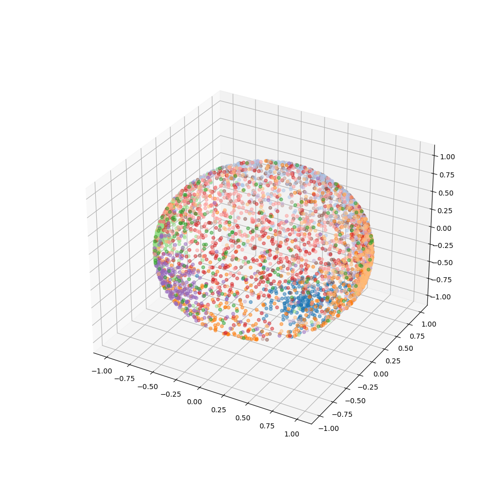
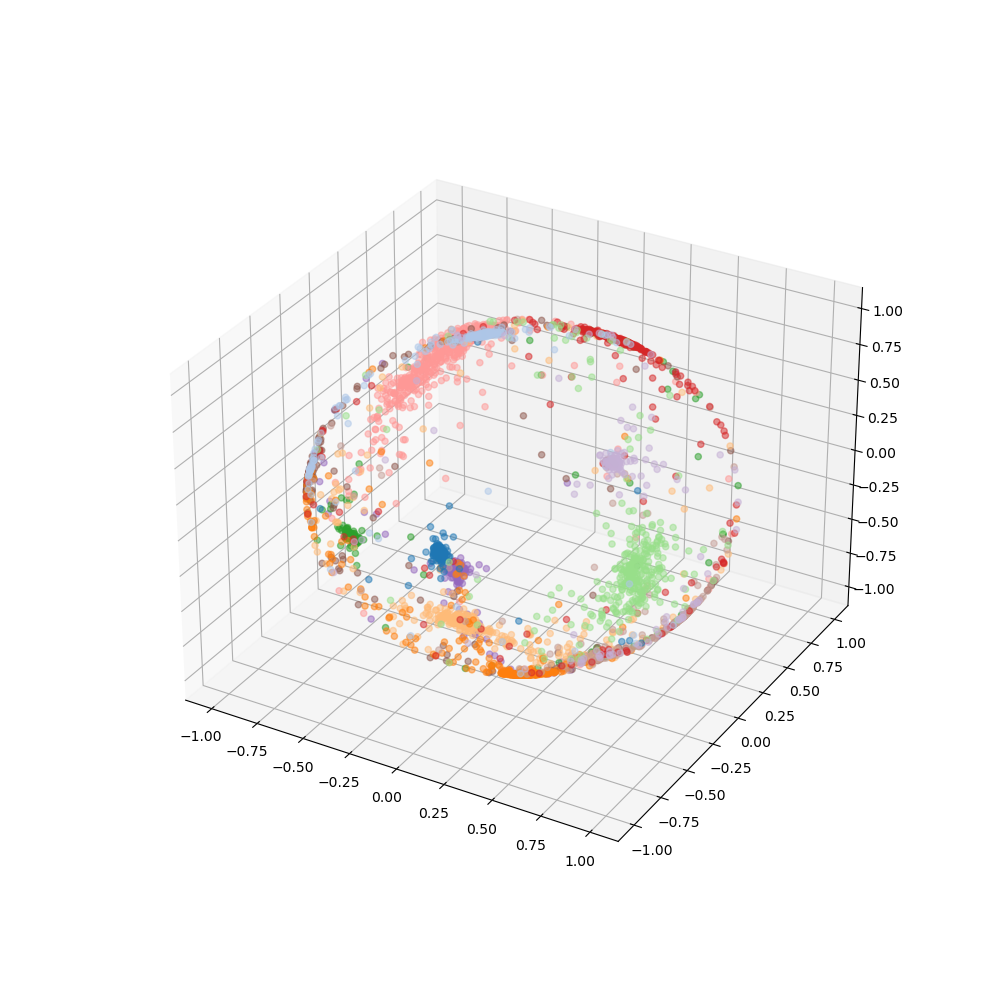
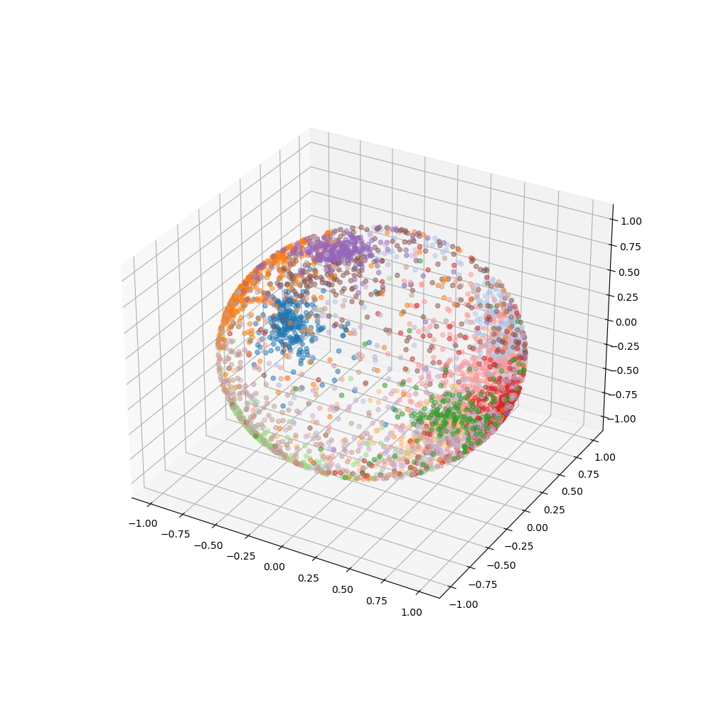

# Metric learning on Stanford Online Products

This repository contains experiments of different metric leanring loss functions applied to image retrieval task on Standord Online Products dataset. Essentially, there are three loss functions in comparison: Softmax, CosFace [1], ArcFace [2]. For each of them I tried to push performance as far as I could. Here you can more learn about the work I've done.

## General training setup
Model: EfficientNetB1, 10 epochs (the best epoch counts), 224x224 images
Optimizer: Adam, lr 3e-4 + (optionally) warmup for 3 epochs
Scheduler: cosine annealing scheduler 

Most of hyperparameters and objects can be found in `run` function in utils.py. To **run training**, type in `python run.py` in console.
Notice that Stanford Online Product dataset should be downloaded and placed in `data` folder.

## Validation strategy
Data split on training and validation sets using StratifiedGroupKFold on "super_class_id" to ensure that no samples representing the same object go into different sets as this might lead to leak. To evaluate the metric learning pipeline, nearest image embedding is found for every image in OOF set, then Recall@K [3] is calculated for K = {3, 5, 10}. Recall@K basically measures the proportion of query vectors for which the nearest neighbor is ranked in first K positions.

## Loss functions
### Softmax
Since general cross-entropy optimizes dot product of vectors and poorly accounts for differences in latent space, the embeddings obtained from training are extremely sparse and show insufficient performance.

### CosFace
CosFace loss is implemented to minimize dot product impact on loss computation and maximize cosine similarity and inter-class difference by applying L2 normalization on both features and weight vectors.

### ArcFace
ArcFace loss is quite similar to CosFace in terms of computation. However, the proper use of margin leads to better geometric properties as the angular margin has the exact correspondence to the geodesic distance. ArcFace training has some important things to consider to get better convergence.
1) Specific output layers. According to the original paper, the scheme of BN-Dropout-FC-BN outperformes the rest. However, it is shown that for my setup BN-GP works better.
3) Non-monotonic nature of cosine with margin. If cos(θ + m) > π, then we have to apply something like Taylor's extension to compute an approximate value. This might not needed to be handled explicitly since θ rarely is big enough to cause such an issue.
2) Advanced residual block setting with different structure and PReLU non-linearity. This feature is not implemented in this work.
4) Linear operation can be optimized, however in my implementation simple transformation from pytorch.nn.functional is used.

## Results
**Comparison of losses**
| Loss  | K = 3 | K = 5 | K = 10 |
| ------------- | ------------- | ------------- | ------------- |
| Softmax  |  0.224  | 0.234 |  0.247  |
| CosFace  |  0.715  | 0.746 |  0.782  |
| ArcFace  |  **0.717** | **0.75** |  **0.79**  |

**ArcFace head comparison**
| Head  | Recall@5 | 
| ------------- | ------------- |
| GP  |  0.723  |
| GP-BN  |  0.713  | 
| DP-GP  |  0.734  | 
| BN-GP  |  **0.758**  | 
| BN-DP-GP-BN  |  0.747  | 

## References
[1] - Wang, H. et al. (2018). CosFace: Large Margin Cosine Loss for Deep Face Recognition. Available at: https://arxiv.org/abs/1801.09414  
[2] - Deng, J. et al. (2018). ArcFace: Additive Angular Margin Loss for Deep Face Recognition. Available at: http://arxiv.org/abs/1801.07698.  
[3] - Jégou, H. et al. (2010). Product quantization for nearest neighbor search. Available at: https://lear.inrialpes.fr/pubs/2011/JDS11/jegou_searching_with_quantization.pdf
